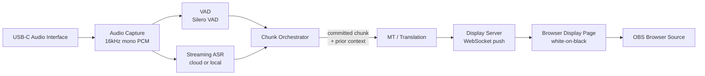

# Live Translation — Technical Spec (v0.1 Draft)

Real-time speech translation for live preaching/teaching. Audio in via
USB-C → transcribe → translate → display as clean white-on-black text,
captured by OBS as a projector feed.

Status: **spec draft, no vendor commitments made yet.** Written to get
alignment before writing pipeline code. Confidence ratings below are the
author's own calibration, not vendor-published guarantees — validate
against a real service before locking in.

---

## 1. Design priorities, in order

1. **Low latency to first visible text** — a preacher mid-sentence should
   see words appear, not a frozen screen.
2. **Coherent, accurate translation** — wrong or garbled translation is
   worse than a half-second of extra delay. This is proclaimed content;
   accuracy matters more than in casual captioning.
3. **Never flicker/retract committed text** — once a line is shown, it
   does not get rewritten. Audiences find retracted captions distracting
   and it undermines trust in the display.
4. **Graceful with run-on speech** — many preachers chain clauses with
   "and," "but," "so" for 15–30s without a hard stop. The chunking
   algorithm (§4) is written specifically for this.

---

## 2. Architecture overview



- **Audio capture**: local process reads the USB-C interface as a system
  audio device (via `sounddevice`/`ffmpeg` or a native CoreAudio/WASAPI
  call), resamples to 16kHz mono, streams PCM frames onward.
- **VAD** runs independently of ASR so chunk-boundary decisions aren't
  hostage to ASR provider latency or its own (often coarser) endpointing.
- **Chunk Orchestrator** is the one genuinely novel piece of this system
  — see §4.
- **Display Server** is a small local WebSocket/SSE server; the display
  itself is just a browser page, so it's portable to any capture tool
  that can embed a URL (OBS Browser Source, vMix, ProPresenter web widget),
  not locked to OBS.

---

## 3. ASR (speech recognition) options

| Option | Type | Est. latency (partial → committed) | Accuracy notes | Ops burden |
|---|---|---|---|---|
| **Deepgram Nova-3** | Cloud, streaming-native | ~150–300ms partials; committed on endpoint | Strong on accented/conversational English, good real-time punctuation | Low — WS API, pay per minute |
| **Azure AI Speech (streaming STT / Speech Translation)** | Cloud, streaming-native | ~200–400ms | Mature, good punctuation, tunable `SegmentationSilenceTimeoutMs` exposes chunk-boundary control natively | Low |
| **Google Cloud STT (Chirp 2, streaming)** | Cloud, streaming-native | ~200–400ms | Very strong multilingual/accent coverage | Low |
| **AssemblyAI Universal-Streaming** | Cloud, streaming-native | ~300ms | Solid general accuracy | Low |
| **NVIDIA Parakeet-TDT (via NeMo/Riva)** | Local, streaming-native | ~150–400ms | Good on clean audio; needs venue-specific tuning for accents | High — GPU box (8GB+ VRAM), NeMo/Riva deploy |
| **faster-whisper / whisper.cpp** (+ streaming wrapper, e.g. "local agreement" buffering) | Local, batch model retrofitted to stream | ~1.5–3s+ to committed text, even with fast compute | Whisper's raw accuracy is excellent, but it wasn't built to emit partials — the wrapper's agreement-buffering is what costs the latency | Medium — GPU recommended, wrapper adds complexity |
| **Moonshine** | Local, small model, edge-oriented | Fast on CPU/small devices but lower accuracy than the above | Interesting for a battery/offline fallback rig, not the primary pick | Low |

**Recommendation: Deepgram Nova-3 or Azure Speech for v1.** Both are
streaming-native (not batch-retrofitted), which is the single biggest
latency lever — bigger than cloud-vs-local. *Confidence: 8/10 on the
ordering; vendor benchmarks shift roughly every 6–12 months, so re-check
before a hard commitment.*

---

## 4. MT (translation) options

| Option | Type | Latency add-on | Notes |
|---|---|---|---|
| **Azure AI Speech Translation** | Combined ASR+MT, one streaming call | None extra — no second network hop | Segmentation ("when is a phrase done") is a first-class config parameter (`SegmentationSilenceTimeoutMs`), which maps directly onto §5 below. Simplest integration; translation quality is solid but generally a notch below specialist MT on the hardest language pairs. |
| **DeepL API** | Cloud, text MT, called after ASR | ~150–350ms per call | Best-in-class quality on EN↔ES and most European pairs; supports custom glossaries (useful for consistent rendering of proper nouns, book names). Narrower language coverage (~30+ langs) than Google. |
| **Google Cloud Translation (NMT)** | Cloud, text MT | ~150–350ms | Broadest language coverage; good general quality. |
| **LLM-based MT (Claude Haiku 4.5 / GPT-4o-mini)** | Cloud, text MT via chat completion | ~300–600ms | Best at handling register, idiom, and — critically for this use case — quoted Scripture and theological vocabulary, if given a glossary/system prompt. Higher latency and cost per call; needs careful prompting to avoid the model "helpfully" expanding or paraphrasing short fragments instead of translating them literally. |
| **NLLB-200 (distilled, local)** | Local MT model | ~50–200ms on GPU | No network hop, 200-language coverage, decent but not best-in-class quality; adds a second model's VRAM footprint alongside local ASR if you go fully local. |

**Recommendation: Azure AI Speech Translation for v1** — folding ASR+MT
into one streaming call removes an entire network round trip and gives
you native chunk-boundary control, which directly serves priority #1
(latency) and priority #3 (no flicker). Design the MT layer behind a
thin interface so DeepL or LLM-based MT (better for idiom/Scripture
fidelity) can be swapped in per-language-pair later without touching the
orchestrator. *Confidence: 6/10 — this is the highest-leverage decision
in the whole spec and worth a side-by-side bake-off with real sermon
audio before locking in; don't take this recommendation as final without
testing.*

**Church-specific consideration:** maintain a small glossary (translator/
book names, denomination-specific terms, the pastor's recurring phrases)
and pass it to whichever MT layer supports custom terms (DeepL glossary,
or a system-prompt term list for LLM MT). Generic MT reliably mangles
proper nouns and Scripture references without this.

---

## 5. Chunking algorithm — "when is a phrase done?"

This is the actual hard problem. Pause-only chunking breaks on
run-on preachers; fixed-duration chunking breaks readability and often
cuts mid-clause. The design below is a hybrid, modeled on how live
broadcast captioning and simultaneous-interpretation systems solve the
same problem (VAD + max-duration fallback + a short settle buffer before
committing). *Confidence: 8/10 that this general shape is right; the
exact numeric defaults below are starting points to tune against real
recordings of your pastors, not settled values.*

**Signals used:**
- VAD speech/silence boundary (Silero VAD — more robust to room noise/
  reverb than WebRTC VAD)
- ASR word-level timestamps + punctuation (most streaming ASR emits
  commas/periods inline)
- A rolling duration counter since the last committed chunk

**Rules, in priority order:**

1. **Primary boundary — pause detection.** Close the chunk when silence
   ≥ `silence_threshold_ms` (default **600ms**). This is the normal case
   and produces the most natural phrase groupings.

2. **Settle buffer before commit.** Streaming ASR sometimes revises the
   last word or two on the next partial. Wait `settle_buffer_ms`
   (default **200ms**) past the pause before treating the chunk as
   final, so a late correction doesn't force a visible on-screen
   retraction. This trades a small amount of latency for priority #3
   (never flicker).

3. **Fallback — max-duration cap.** If no qualifying pause occurs within
   `max_chunk_duration_s` (default **10s**), force a boundary anyway —
   this is what actually handles a preacher running one clause into the
   next for 30 seconds. Don't cut at an arbitrary sample: walk backward
   from the cap to the nearest clause boundary the ASR has already
   punctuated (comma, or before a coordinating conjunction — "and,"
   "but," "so," "because"), so the forced cut still lands somewhere a
   reader would naturally pause. If literally nothing qualifies, cut at
   the cap and accept an awkward break — better than a 30-second wall of
   silence on screen.

4. **Minimum-duration floor.** Reject a candidate boundary if the chunk
   would be under `min_chunk_duration_s` (default **1.2s**) — this
   prevents a quick breath or filler ("uh," "you know") from fragmenting
   output into unreadable one-word bursts.

5. **Translate with rolling context, never re-translate.** Each
   committed chunk is translated with the previous
   `mt_context_window` (default **2**) already-committed chunks passed
   as context (native context param if the MT API supports it, or a
   short history in the prompt for LLM-based MT). This keeps pronouns
   and mid-thought continuations coherent across a forced max-duration
   cut, without ever reopening or rewriting a chunk that's already on
   screen — satisfies priority #3.

6. **Two-tier display for perceived latency.** While a chunk is still
   open, stream the *live, untranslated* partial transcript to the
   display in a dim/italic state so the audience sees continuous motion.
   The instant a chunk commits and its translation returns, swap in the
   full-brightness translated paragraph. This doesn't reduce actual
   pipeline latency, but it removes the "is this thing frozen?" feeling
   that dominates perceived latency in live captioning.

**Config surface (all tunable per install, since pastors' pacing
varies):**

```yaml
chunking:
  silence_threshold_ms: 600
  settle_buffer_ms: 200
  max_chunk_duration_s: 10
  min_chunk_duration_s: 1.2
  mt_context_window: 2
```

---

## 6. Display

- v1: a single static browser page — white text (configurable) centered
  on black background, auto-wrapping paragraphs, smooth crossfade
  transition on chunk commit (no hard cuts/flicker), capped to N visible
  lines with older lines scrolling off.
- Served locally (e.g. `http://localhost:PORT/display`); OBS adds it as
  a **Browser Source** pointed at that URL — no OBS plugin needed, and
  the same URL works in any tool that can embed a web view.
- Updates pushed via WebSocket from the orchestrator (lowest-latency
  local delivery — no polling).
- Config-driven styling (`config/display.yaml`): font, size, colors,
  max lines, live-partial dim style, language label — so "beautiful and
  configurable" doesn't require code changes per service/venue.

---

## 7. Open decisions before implementation starts

1. Confirm ASR + MT vendor pick (§3–4) — recommend running a short
   bake-off against 5–10 minutes of real sermon audio, not just specs.
2. API keys/accounts for the chosen cloud vendor(s).
3. Confirm the USB-C audio interface model, so capture code targets the
   right driver/sample format.
4. Default source→target language pair confirmed as **English → Spanish**
   for initial build/test.

---
*This spec is a starting point for review, not a committed architecture.*
