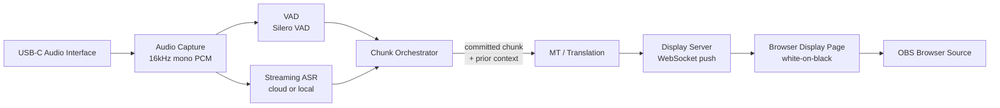

# Live Translation — Technical Spec (v0.1 Draft)

Real-time speech translation for live preaching/teaching. Audio in via
USB-C → transcribe → translate → display as clean white-on-black text,
captured by OBS as a projector feed.

Status: **spec draft, no vendor commitments made yet.** Written to get
alignment before writing pipeline code. Confidence ratings below are the
author's own calibration, not vendor-published guarantees — validate
against a real service before locking in.

---

## 1. Design priorities, in order

1. **Low latency to first visible text** — a preacher mid-sentence should
   see words appear, not a frozen screen.
2. **Coherent, accurate translation** — wrong or garbled translation is
   worse than a half-second of extra delay. This is proclaimed content;
   accuracy matters more than in casual captioning.
3. **Never flicker/retract committed text** — once a line is shown, it
   does not get rewritten. Audiences find retracted captions distracting
   and it undermines trust in the display.
4. **Graceful with run-on speech** — many preachers chain clauses with
   "and," "but," "so" for 15–30s without a hard stop. The chunking
   algorithm (§4) is written specifically for this.

---

## 2. Architecture overview



- **Audio capture**: local process reads the USB-C interface as a system
  audio device (via `sounddevice`/`ffmpeg` or a native CoreAudio/WASAPI
  call), resamples to 16kHz mono, streams PCM frames onward.
- **VAD** runs independently of ASR so chunk-boundary decisions aren't
  hostage to ASR provider latency or its own (often coarser) endpointing.
- **Chunk Orchestrator** is the one genuinely novel piece of this system
  — see §4.
- **Display Server** is a small local WebSocket/SSE server; the display
  itself is just a browser page, so it's portable to any capture tool
  that can embed a URL (OBS Browser Source, vMix, ProPresenter web widget),
  not locked to OBS.

---

## 3. ASR (speech recognition) options

| Option | Type | Est. latency (partial → committed) | Accuracy notes | Ops burden |
|---|---|---|---|---|
| **Deepgram Nova-3** | Cloud, streaming-native | ~150–300ms partials; committed on endpoint | Strong on accented/conversational English, good real-time punctuation | Low — WS API, pay per minute |
| **Azure AI Speech (streaming STT / Speech Translation)** | Cloud, streaming-native | ~200–400ms | Mature, good punctuation, tunable `SegmentationSilenceTimeoutMs` exposes chunk-boundary control natively | Low |
| **Google Cloud STT (Chirp 2, streaming)** | Cloud, streaming-native | ~200–400ms | Very strong multilingual/accent coverage | Low |
| **AssemblyAI Universal-Streaming** | Cloud, streaming-native | ~300ms | Solid general accuracy | Low |
| **NVIDIA Parakeet-TDT (via NeMo/Riva)** | Local, streaming-native | ~150–400ms | Good on clean audio; needs venue-specific tuning for accents | High — GPU box (8GB+ VRAM), NeMo/Riva deploy |
| **faster-whisper / whisper.cpp** (+ streaming wrapper, e.g. "local agreement" buffering) | Local, batch model retrofitted to stream | ~1.5–3s+ to committed text, even with fast compute | Whisper's raw accuracy is excellent, but it wasn't built to emit partials — the wrapper's agreement-buffering is what costs the latency | Medium — GPU recommended, wrapper adds complexity |
| **Moonshine** | Local, small model, edge-oriented | Fast on CPU/small devices but lower accuracy than the above | Interesting for a battery/offline fallback rig, not the primary pick | Low |

**Decision for v1: local, free, small-model Whisper (faster-whisper).**
Cost and no-dependency-on-venue-internet were prioritized over shaving
the last few hundred ms off latency. Specifically:

- **Engine:** `faster-whisper` (CTranslate2 runtime — meaningfully
  faster than stock `openai-whisper`/HF transformers on the same
  hardware, int8/float16 quantized).
- **Model size:** start with `small.en` (English source) — best
  accuracy-per-latency point below `medium`; drop to `base.en` if the
  venue machine is CPU-only and can't sustain `small` in real time, or
  move up to `medium.en` if a GPU is available and accuracy on pulpit
  audio (mic bleed, room reverb, accents) needs it. Bake this off on
  real recordings, don't guess.
- **Streaming wrapper:** Whisper is batch, not streaming — use the
  "local agreement" pattern (à la `whisper_streaming`): re-transcribe a
  sliding window every ~500ms–1s, only emit/commit words that agree
  across consecutive hypotheses. This is what makes the latency
  numbers in the table above achievable at all with a batch model.
- **Cost:** $0. **Latency tradeoff accepted:** ~1.5–3s to committed
  text vs. ~150–400ms for a streaming-native cloud/GPU model — this is
  the real price of "free and local," not a rounding error. It's
  mitigated somewhat by the two-tier display (§5, rule 6): the live
  partial transcript still shows motion during that window, so the
  audience isn't staring at a frozen screen even though committed text
  lags.
- **Swap path kept open:** the ASR client sits behind the same thin
  interface as MT (§4) — if the 1.5–3s commit latency proves too slow
  once you've heard it live, NVIDIA Parakeet-TDT (still local, still
  free-ish, but streaming-native and GPU-required) is the documented
  next step, not Deepgram/Azure — that keeps the "free and local"
  constraint if latency needs to improve without going back to a paid
  cloud dependency.

*Confidence: 7/10 on the ordering of model sizes and the streaming-
wrapper approach; the exact model that holds up on your pastors'
specific voices/accents/room acoustics is something to verify by ear,
not assume from a spec.*

---

## 4. MT (translation) options — pricing × latency matrix

**Status: intentionally still open.** ASR is now local/free (§3), so the
MT call is the only per-word cost and the only remaining network hop in
the pipeline — worth picking with real numbers rather than a gut call.
The plan is to iterate on this against actual pipeline runs, not lock it
in from the spec.

Cost basis for the "$/sermon" column: a ~45-minute sermon at ~130
words/min ≈ 5,850 words ≈ **~35,000 characters** (English source).
Chunked at the §5 defaults (avg. ~15 words/chunk, ~7s of speech) that's
roughly **~390 translation calls per sermon** — the call count matters
for the LLM-based row, where per-call overhead (not just character
count) drives cost and latency.

| Option | Pricing (source: vendor pricing pages, checked Sep 2026) | Est. cost / 45-min sermon | Est. latency per call | Notes |
|---|---|---|---|---|
| **DeepL API** (Pro pay-as-you-go) | $5.49 / million characters, no monthly cap ([source](https://www.eesel.ai/blog/deepl-pricing)) | **~$0.19** | ~150–350ms | Best-in-class quality on EN↔ES and most European pairs; supports custom glossaries. Growth plan ($26/mo, 1M chars/mo included) effectively makes this flat-rate for a single-venue church. Narrower language coverage (~30+ langs) than Google. |
| **Azure AI Translator** | $10 / million characters; **2M chars/month free for the first year** ([source](https://azure.microsoft.com/en-in/pricing/details/translator/)) | **~$0.35** (likely **$0** in year one) | ~150–350ms | 130+ languages, glossary/custom terminology support. Cheapest at true scale via commitment tiers if this ever grows beyond one venue. |
| **Google Cloud Translation (NMT)** | $20 / million characters; 500K chars/month free ([source](https://cloud.google.com/translate/pricing)) | **~$0.70** (free under ~14 sermons/month) | ~150–350ms | Broadest language coverage; good general quality; glossary support via AutoML/custom models. |
| **LLM-based MT — Claude Haiku 4.5** | $1.00 / MTok input, $5.00 / MTok output | **~$0.13–0.20** (≈390 calls × ~220 in / ~25 out tokens each; drops further with prompt caching on the shared glossary/system prompt) | **Unvalidated — estimate ~300–600ms**, needs a real benchmark before trusting it | Best of the group at handling register, idiom, and — specifically relevant here — quoted Scripture and theological vocabulary, given a glossary in the system prompt. Needs careful prompting so it translates short fragments literally instead of "helpfully" paraphrasing or completing them. Cost is a non-issue at this volume for any of these vendors — the real tradeoff is latency-per-call and fragment-literalness, not price. |
| **NLLB-200 (distilled, local)** | $0 (self-hosted) | **$0** | ~50–200ms on GPU (no network hop) | No per-word cost, no network dependency — pairs naturally with the local-ASR decision in §3 if venue internet ever becomes the constraint. Quality is decent but a step below the specialist cloud APIs above; would need its own bake-off against sermon audio. |

**Reading the matrix:** at this call volume (~390 short calls/sermon,
a few times a week), **every option costs pennies to a few dollars a
month** — cost is not the deciding factor here, whatever the framing
above suggests. The real axes to bake off against actual pipeline runs
are (a) **latency per call**, since this stacks directly onto the ASR
commit latency from §3, and (b) **fragment quality** — does the vendor
translate a bare 10–15-word clause correctly without either literal-
but-awkward output (hurts readability) or over-confident paraphrasing
(hurts faithfulness to what was actually said, which matters more here
than in casual captioning). Haiku's per-call latency above is an
estimate, not a benchmark — measure it directly before weighing it
against DeepL/Azure/Google's more predictable ~150–350ms.

**Church-specific consideration, applies to whichever vendor is
chosen:** maintain a small glossary (translator/book names,
denomination-specific terms, the pastor's recurring phrases) and pass it
to whichever MT layer supports custom terms (DeepL glossary, Azure
custom terminology, or a system-prompt term list for LLM MT). Generic MT
reliably mangles proper nouns and Scripture references without this.

---

## 5. Chunking algorithm — "when is a phrase done?"

**Decision: adopt this design as the v1 first pass, then tune it with
evals against real recordings rather than guessing at the numbers
up front.** This is the actual hard problem. Pause-only chunking breaks
on run-on preachers; fixed-duration chunking breaks readability and
often cuts mid-clause. The design below is a hybrid, modeled on how live
broadcast captioning and simultaneous-interpretation systems solve the
same problem (VAD + max-duration fallback + a short settle buffer before
committing). *Confidence: 8/10 that this general shape is right; the
exact numeric defaults below are starting points to tune against real
recordings of your pastors, not settled values.*

**Signals used:**
- VAD speech/silence boundary (Silero VAD — more robust to room noise/
  reverb than WebRTC VAD)
- ASR word-level timestamps + punctuation (most streaming ASR emits
  commas/periods inline)
- A rolling duration counter since the last committed chunk

**Rules, in priority order:**

1. **Primary boundary — pause detection.** Close the chunk when silence
   ≥ `silence_threshold_ms` (default **600ms**). This is the normal case
   and produces the most natural phrase groupings.

2. **Settle buffer before commit.** Streaming ASR sometimes revises the
   last word or two on the next partial. Wait `settle_buffer_ms`
   (default **200ms**) past the pause before treating the chunk as
   final, so a late correction doesn't force a visible on-screen
   retraction. This trades a small amount of latency for priority #3
   (never flicker).

3. **Fallback — max-duration cap.** If no qualifying pause occurs within
   `max_chunk_duration_s` (default **10s**), force a boundary anyway —
   this is what actually handles a preacher running one clause into the
   next for 30 seconds. Don't cut at an arbitrary sample: walk backward
   from the cap to the nearest clause boundary the ASR has already
   punctuated (comma, or before a coordinating conjunction — "and,"
   "but," "so," "because"), so the forced cut still lands somewhere a
   reader would naturally pause. If literally nothing qualifies, cut at
   the cap and accept an awkward break — better than a 30-second wall of
   silence on screen.

4. **Minimum-duration floor.** Reject a candidate boundary if the chunk
   would be under `min_chunk_duration_s` (default **1.2s**) — this
   prevents a quick breath or filler ("uh," "you know") from fragmenting
   output into unreadable one-word bursts.

5. **Translate with rolling context, never re-translate.** Each
   committed chunk is translated with the previous
   `mt_context_window` (default **2**) already-committed chunks passed
   as context (native context param if the MT API supports it, or a
   short history in the prompt for LLM-based MT). This keeps pronouns
   and mid-thought continuations coherent across a forced max-duration
   cut, without ever reopening or rewriting a chunk that's already on
   screen — satisfies priority #3.

6. **Two-tier display for perceived latency.** While a chunk is still
   open, stream the *live, untranslated* partial transcript to the
   display in a dim/italic state so the audience sees continuous motion.
   The instant a chunk commits and its translation returns, swap in the
   full-brightness translated paragraph. This doesn't reduce actual
   pipeline latency, but it removes the "is this thing frozen?" feeling
   that dominates perceived latency in live captioning.

**Config surface (all tunable per install, since pastors' pacing
varies):**

```yaml
chunking:
  silence_threshold_ms: 600
  settle_buffer_ms: 200
  max_chunk_duration_s: 10
  min_chunk_duration_s: 1.2
  mt_context_window: 2
```

### Evaluation plan — tuning the defaults against real runs

Ship the numbers above as the starting config, then tune them from
recorded evidence, not intuition:

1. **Collect real audio.** Record several full sermons (ideally from
   more than one pastor — pacing varies a lot person to person) through
   the actual capture path.
2. **Run the pipeline offline** against those recordings with logging
   on every chunk boundary: what triggered it (pause vs. max-duration
   fallback), the chunk's duration, and its word count.
3. **Score against a small set of metrics:**
   - **% of chunks closed by pause vs. forced by max-duration** — a
     healthy pipeline should be pause-dominated; a high forced-cut rate
     on a given pastor means `max_chunk_duration_s` or
     `silence_threshold_ms` needs adjusting for their delivery style.
   - **Chunk duration distribution** — flag chunks near the
     `min_chunk_duration_s` floor (near-fragmentation) and chunks near
     the `max_chunk_duration_s` ceiling (near-runaway) as the two
     failure edges to inspect by ear.
   - **Readability of forced cuts** — manually review a sample of
     max-duration-triggered cuts: did the clause-boundary walk-back
     (rule 3) land somewhere sensible, or mid-phrase?
   - **Commit-to-display latency**, measured end to end, not just the
     chunking logic in isolation — this is the number that actually
     matters to someone watching the screen.
   - **Retraction rate** — how often the settle buffer (rule 2) still
     wasn't enough and a committed chunk had to be visually corrected;
     should be ~0 by design, so any non-zero rate is a bug, not a
     tuning target.
4. **Adjust one parameter at a time** against the same recording set
   and re-score, rather than changing several defaults at once — this
   is what makes the tuning attributable instead of guesswork with
   extra steps.

---

## 6. Display

- v1: a single static browser page — white text (configurable) centered
  on black background, auto-wrapping paragraphs, smooth crossfade
  transition on chunk commit (no hard cuts/flicker), capped to N visible
  lines with older lines scrolling off.
- Served locally (e.g. `http://localhost:PORT/display`); OBS adds it as
  a **Browser Source** pointed at that URL — no OBS plugin needed, and
  the same URL works in any tool that can embed a web view.
- Updates pushed via WebSocket from the orchestrator (lowest-latency
  local delivery — no polling).
- Config-driven styling (`config/display.yaml`): font, size, colors,
  max lines, live-partial dim style, language label — so "beautiful and
  configurable" doesn't require code changes per service/venue.

---

## 7. Open decisions before implementation starts

**Decided:**
- ASR: local `faster-whisper` (§3) — free, no venue-internet
  dependency, latency tradeoff accepted knowingly.
- Chunking: adopt the §5 design and defaults as v1, tune via the
  evaluation plan against real recordings rather than pre-guessing.
- Default language pair: **English → Spanish** for initial build/test.

**Still open:**
1. **MT vendor** (§4) — the pricing/latency matrix is built; pick one
   (or run the DeepL/Azure/Google/Haiku bake-off in parallel with early
   implementation) once real per-call latency numbers are in hand,
   especially for the LLM-based option, which is currently an estimate.
2. API key/account for whichever MT vendor is chosen.
3. Confirm the USB-C audio interface model, so capture code targets the
   right driver/sample format.
4. Local machine spec at the venue (CPU-only vs. GPU-available) — this
   decides whether `small.en` or `base.en` is the realistic Whisper
   model size for v1.

---
*This spec is a starting point for review, not a committed architecture.*
