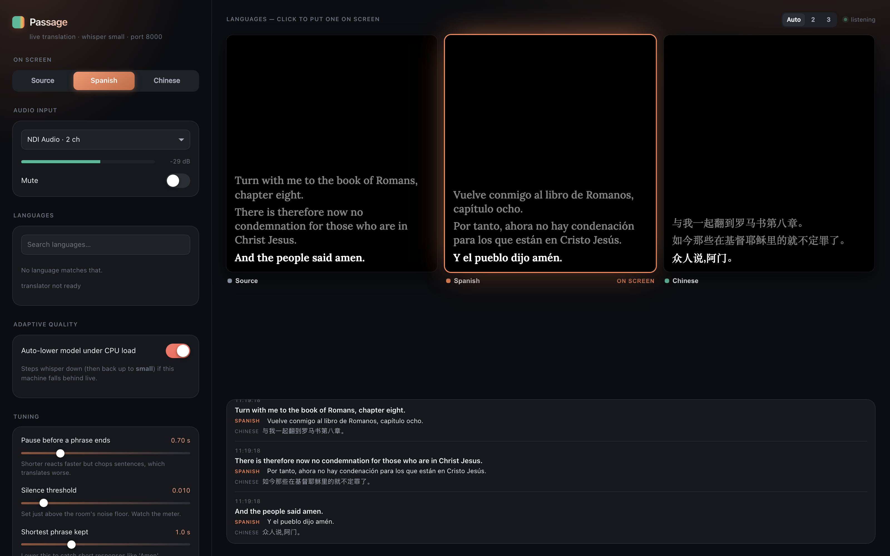
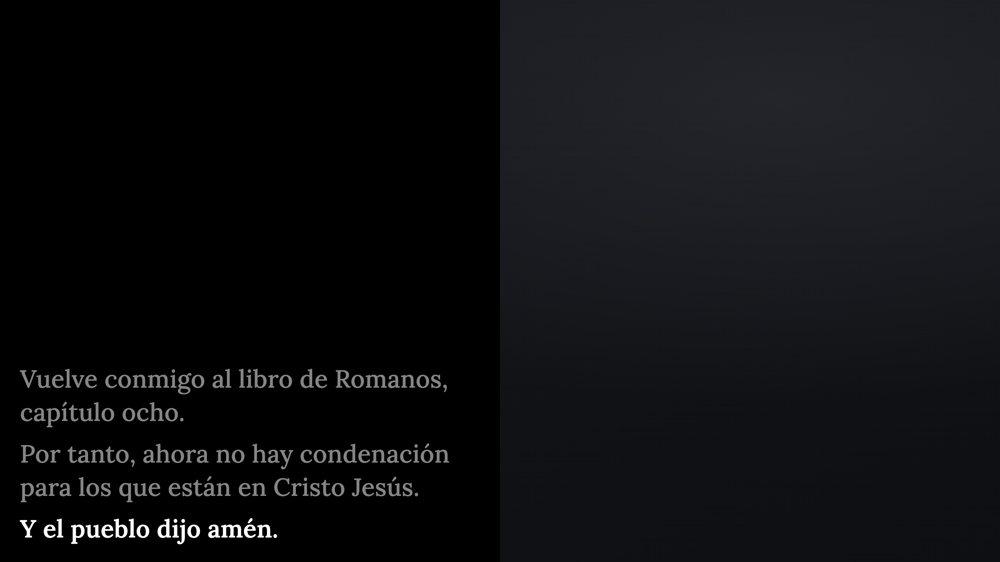

# Sunday runbook

For whoever is running the booth. No terminal, no code. Five minutes.

Passage installs as a login service, so it is **already running** whenever the
Mac is on. You are checking it, not starting it.

---

## Before the service

### 1. Turn on the Mac and log in

That is all it takes to start Passage. Give it about twenty seconds — it loads
the speech model at startup.

### 2. Open the control page

Go to **http://localhost:8000/** in any browser. Bookmark it.



### 3. Check audio is arriving

Look at the **level meter** under Audio input. With sound playing it should move
and the dot by the preview should read **listening**.

| What you see | What to do |
|---|---|
| Meter moving, "listening" | Nothing. It is working. |
| Meter flat, "idle" | Pick a different input from the dropdown and watch again |
| "No signal for Ns" warning | The selected input has gone quiet — change it |
| Page will not load | Skip to **If it is not running** below |

The input is normally **NDI Audio**, which only carries sound while OBS is
running and producing audio. If OBS is not started yet, a flat meter is
expected — start OBS first, then re-check.

### 4. Pick the language

Click a language tile. The outlined one is what the congregation sees.

### 5. Check OBS

The subtitle overlay is a Browser Source pointing at
`http://localhost:8000/display/active`. It follows the tile you picked, so you
never have to touch OBS once it is set up.



If the source is missing, add it: **Sources → + → Browser**, URL
`http://localhost:8000/display/active`, width **1920**, height **1080**, and
leave it at position 0,0 without resizing. The panel fills the left half of the
canvas by design.

---

## During the service

Everything runs by itself. Two things you might use:

- **Switch language** — click another tile. It changes instantly.
- **Mute** — the switch under Audio input stops subtitles without stopping
  anything else. Useful during music, or anything not meant to be captioned.

Subtitles blank automatically after about twelve seconds of silence, so the last
sentence does not stay on screen through a quiet moment. That is normal.

---

## If something goes wrong

### Subtitles stopped appearing

1. Look at the level meter. Flat means no audio is arriving — that is a routing
   problem in OBS or the audio desk, not Passage.
2. Check the **Mute** switch is off.
3. Reload the control page.

### Subtitles are wrong or nonsense

Short sounds and background noise can produce odd lines. Under **Tuning**, nudge
**Silence threshold** up slightly while watching the meter, so room noise sits
below the line.

### It is not running at all

The service restarts itself if it stops, so this is rare. If the page will not
load after a minute, open Terminal and paste:

```bash
launchctl kickstart -k gui/$UID/com.alabgroup.passage
```

Wait twenty seconds and reload the page. If that fails, the log is at
`logs/passage.log` in the project folder — send the last twenty lines to whoever
maintains this.

### Nothing works and the service is about to start

Open OBS and carry on without subtitles. Nothing about Passage affects the
stream or the recording — the overlay is a separate source, and removing or
hiding it changes nothing else.

---

## What not to change

- **Tuning sliders** beyond the silence threshold — they affect how sentences are
  detected and are easy to make worse under pressure.
- **Adding a language** mid-service — the first use of a language downloads about
  100 MB and takes a minute.
- **Recording** (`RECORD_AUDIO` in the config) — off by default on purpose. It
  writes roughly 115 MB per hour and is only for measuring accuracy afterwards.
